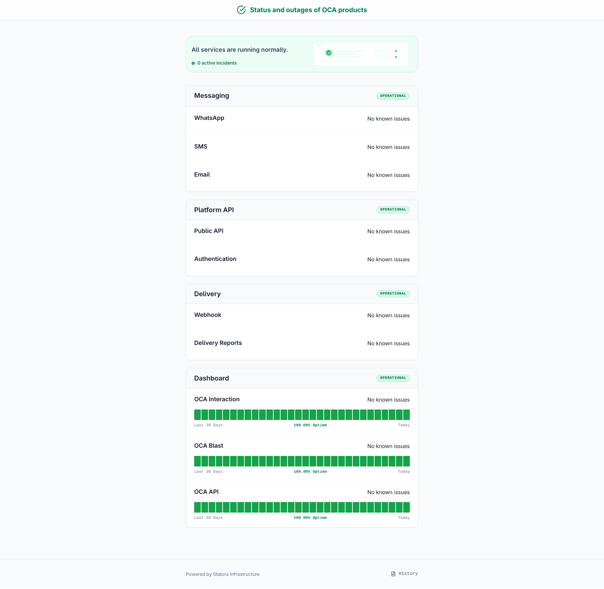
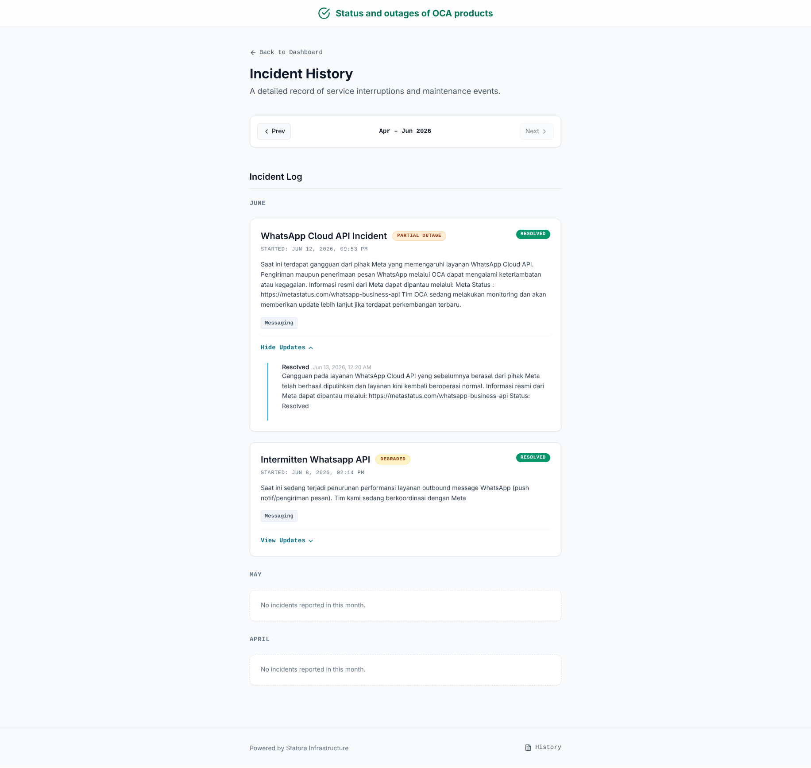
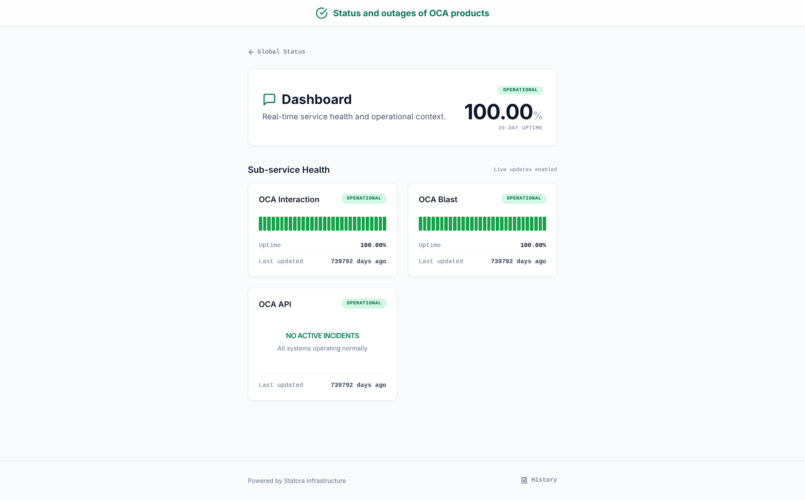
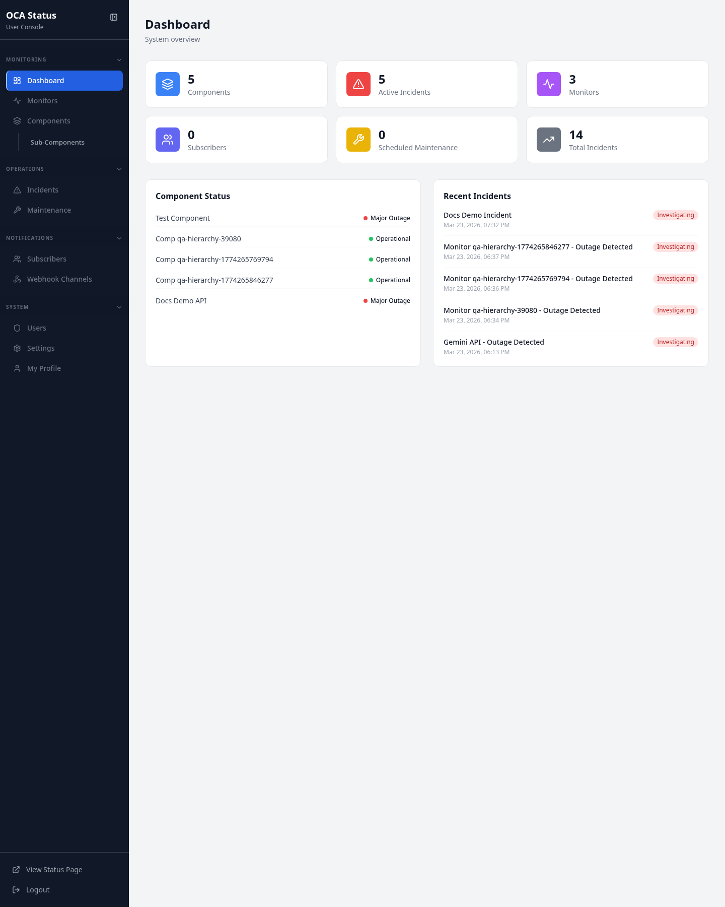
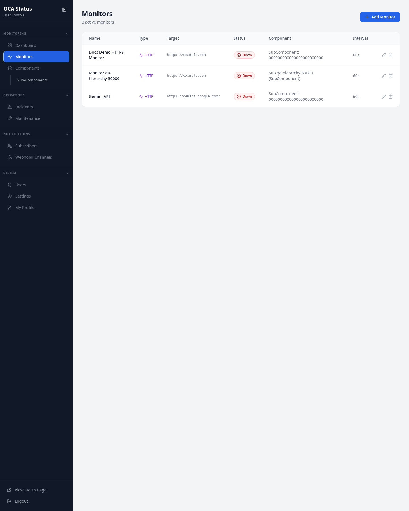
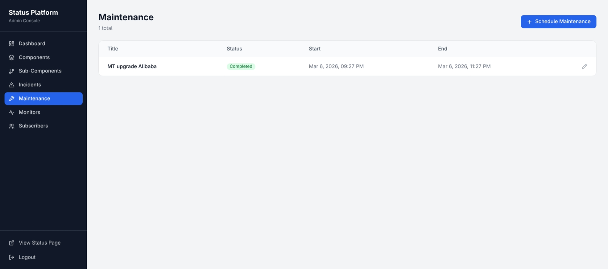
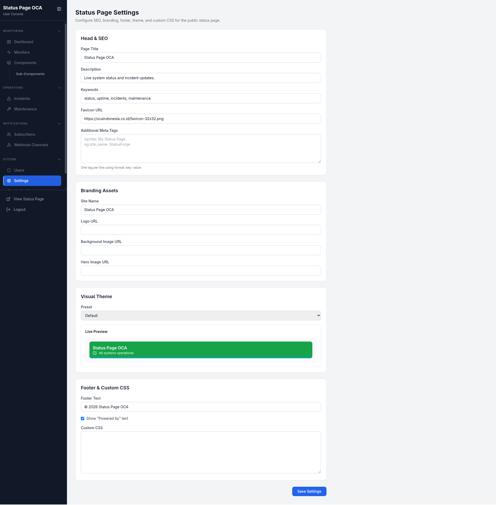

# Statora


Statora is a self-hosted status page and uptime monitoring platform that combines public status communication, incident and maintenance workflows, active monitoring, and an admin console in one deployable application.

## Overview

Statora is designed for teams that want to run their own status workflow instead of depending on a hosted third-party service. The current implementation pairs a Go-based API and monitoring runtime with an embedded React single-page application, so the public status site and admin interface ship together.

The platform covers three connected jobs:

- publish a public-facing status page for services and components
- manage incidents and maintenance from an authenticated admin area
- monitor services continuously and turn failures into operational signals

## Features

Only features verified in the current repository implementation are listed here.

### Public status experience

- Public status homepage with overall summary, incidents, maintenance, and component health
- Category-specific status pages under `/status/:categoryPrefix`
- Incident history page under `/history`
- Real-time status refresh through WebSocket updates
- Public status settings endpoint used for branding, theme, and footer content

### Incident and maintenance workflows

- Create, edit, view, delete, and resolve incidents from the admin UI
- Add incident updates and retrieve incident audit history
- Create, edit, view, and delete maintenance windows
- Retrieve maintenance audit history
- Rich-text authoring and rendering for incident and maintenance descriptions
- Backward-compatible dual-format content model that keeps plain-text fields alongside optional rich-text JSON payloads
- Maintenance workflow compatibility for both legacy `in_progress` and current `active` states

### Monitoring and reliability

- Active monitoring for HTTP, TCP, DNS, Ping, and SSL checks
- Configurable intervals, timeouts, SSL warning thresholds, and domain expiry checks
- Worker-driven monitor execution with monitor logs, uptime tracking, and outage tracking
- Automatic outage detection after repeated failures
- Automatic incident creation when a detected outage is not already covered by an active incident
- Automatic maintenance status transitions based on scheduled start and end times
- Health endpoint for runtime readiness checks

### Administration and access control

- Admin login/logout flow with JWT-backed authentication
- MFA setup, verification, recovery verification, and disable flows
- Role-aware access control for `admin` and `operator`
- User invitation activation flow
- Member management for listing, updating, inviting, refreshing, revoking, and deleting users
- Admin management screens for components, subcomponents, monitors, incidents, maintenance, subscribers, webhook channels, and settings

### Realtime and integrations

- WebSocket endpoint for live status updates
- Webhook channel management from the admin UI
- Public subscribe endpoint and admin subscriber management
- SSO callback endpoint for external authentication flows

## Screenshots

### Public experience

| Status Page | Incident History | Service Details |
|---|---|---|
|  |  |  |

### Admin experience

| Dashboard | Monitoring | Maintenance | Settings |
|---|---|---|---|
|  |  |  |  |

## Architecture

Statora currently follows a unified application pattern:

```text
Browser
  -> React SPA
  -> HTTP /api + WebSocket /ws
  -> Gin handlers
  -> services
  -> repositories
  -> MongoDB

Monitoring worker
  -> monitor checks
  -> MongoDB updates
  -> WebSocket broadcasts
```

At runtime, one Go server process:

- loads configuration from environment variables
- connects MongoDB and Redis
- serves API routes and `/health`
- serves the embedded frontend bundle
- runs the WebSocket hub
- optionally runs the in-process monitoring worker

For the full system layout, see [docs/architecture.md](docs/architecture.md).

## Tech Stack

- **Backend:** Go 1.26, Gin, MongoDB driver, Gorilla WebSocket
- **Frontend:** React 18, TypeScript 5, Vite 5, Tailwind CSS 3
- **Rich text editing:** TipTap 2
- **Data stores:** MongoDB 7, Redis 7
- **Authentication:** JWT, MFA with TOTP
- **Deployment:** Docker multi-stage build, Docker Compose

## Getting Started

### Run with Docker Compose

```bash
git clone https://github.com/fresp/Statora.git
cd Statora
cp .env.example .env
docker compose up --build
```

### Default local endpoints

- Public status page: `http://localhost:8080/`
- Admin area: `http://localhost:8080/admin`
- Health endpoint: `http://localhost:8080/health`
- WebSocket endpoint: `ws://localhost:8080/ws`

### Default bootstrap admin

The repository includes bootstrap values in `.env.example`:

- `ADMIN_EMAIL=admin@statusplatform.com`
- `ADMIN_USERNAME=admin`
- `ADMIN_PASSWORD=admin123`

Change these before using any shared or persistent environment.

### Important environment variables

- `MONGODB_URI` - MongoDB connection string
- `MONGODB_DB` - MongoDB database name
- `REDIS_URI` - Redis connection string
- `JWT_SECRET` - JWT signing secret
- `APP_ENCRYPTION_KEY` - 32-byte application encryption key
- `MFA_SECRET_KEY` - MFA secret protection key
- `ENABLE_WORKER` - enables the monitoring worker
- `GRACEFUL_SHUTDOWN` - toggles graceful shutdown behavior

## API Overview

Statora exposes a public status surface and a protected admin API.

### Public routes

- `GET /api/status/summary`
- `GET /api/status/components`
- `GET /api/status/incidents`
- `GET /api/status/category/:prefix`
- `GET /api/status/settings`
- `GET /api/status/maintenance`
- `POST /api/subscribe`
- `GET /ws`

### Authenticated admin routes

The admin API includes routes for:

- profile and MFA flows
- incidents and incident updates
- maintenance
- components and subcomponents
- monitors, logs, uptime, history, outages, and metrics
- subscribers
- webhook channels
- users and invitations
- status-page settings

## Authentication

Statora uses JWT-based authentication with MFA-aware access control.

- Users authenticate through `/api/auth/login`
- Protected routes require valid JWT authentication
- MFA verification is enforced before access to the protected admin experience
- Role checks separate `admin`-only routes from routes shared with `operator`
- SSO callback support is available through `/sso/callback`

## Roadmap

Based on the current codebase state, the most realistic next improvements are:

- production hardening of permissive default CORS configuration
- deeper operational documentation for API and deployment workflows
- clearer separation of worker/runtime scaling concerns
- broader automated UI verification coverage

## Contributing

Contributions are welcome. Keep changes aligned with the current layered structure:

- handlers for HTTP transport concerns
- services for business logic
- repositories for persistence
- focused frontend pages and shared components for UI behavior

When updating the platform, prefer backward-compatible data evolution over breaking schema assumptions.

## License

Licensed under the [MIT License](LICENSE).
