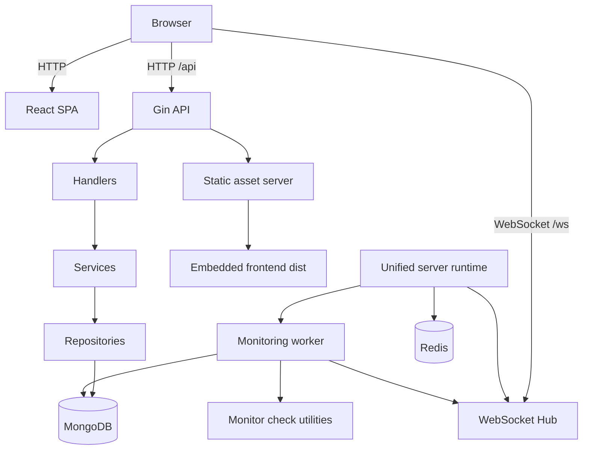

# Statora Architecture

This document describes the current repository implementation of Statora after the incident and maintenance workflow upgrade.

## 1. High-Level Architecture

Statora is implemented as a unified Go application that serves three roles in one runtime:

- JSON API for public and admin workflows
- embedded React single-page application for public and admin interfaces
- in-process monitoring worker and WebSocket hub

The main entry point is `cmd/server/main.go`, which delegates to `internal/server/server.go`.

## 2. Layers

### 2.1 Runtime bootstrap

`internal/server/server.go` is the composition root. It:

- loads environment values through `godotenv`
- validates configuration from `configs/config.go`
- connects MongoDB and Redis
- creates and runs the WebSocket hub
- registers API routes and `/health`
- starts the monitoring worker when `ENABLE_WORKER=true`
- seeds the bootstrap admin user
- serves the embedded frontend bundle through the Gin `NoRoute` fallback

### 2.2 Transport layer

`internal/server/api_routes.go` defines the HTTP and WebSocket surface.

Public routes include:

- `/api/status/summary`
- `/api/status/components`
- `/api/status/incidents`
- `/api/status/category/:prefix`
- `/api/status/settings`
- `/api/status/maintenance`
- `/api/subscribe`
- `/ws`
- `/sso/callback`

Authenticated routes are layered as:

1. JWT-authenticated routes
2. MFA-verified routes
3. role-restricted groups for `admin` or `admin` + `operator`

The transport implementation lives in `internal/handlers/*`.

### 2.3 Middleware and security layer

`internal/middleware/auth.go` enforces:

- JWT authentication
- MFA verification gates
- role-based access control

The current implementation accepts JWTs from the `Authorization` header or the `statora_auth` cookie. The frontend primarily uses bearer tokens stored in browser storage.

### 2.4 Service layer

`internal/services/*` contains application logic for domains such as:

- auth
- status aggregation
- incidents
- maintenance
- monitors
- subscribers
- webhook dispatch

This layer contains the workflow rules that should remain independent from HTTP transport concerns.

### 2.5 Repository layer

`internal/repository/*` encapsulates MongoDB persistence. The repositories back:

- status read models
- monitors, monitor logs, uptime, and outages
- incidents and incident updates
- maintenance windows
- audit logs
- users, invitations, and admin state
- webhook channels and subscriber records

### 2.6 Frontend layer

The frontend source lives in `apps/web/` and is built with Vite. The built assets are copied into `internal/embed/dist` during the Docker build, then served by the Go server.

The route tree is defined in `apps/web/src/App.tsx`.

Public routes:

- `/`
- `/status/:categoryPrefix`
- `/history`

Admin routes:

- `/admin/login`
- `/admin/activate`
- `/admin/profile`
- `/admin/components`
- `/admin/subcomponents`
- `/admin/incidents`
- `/admin/maintenance`
- `/admin/monitors`
- `/admin/monitors/:id/logs`
- `/admin/subscribers`
- `/admin/webhook-channels`
- `/admin/users`
- `/admin/settings`

## 3. Data Flow

### 3.1 Standard HTTP flow

The normal backend request path is:

1. Request enters Gin
2. CORS middleware runs
3. Route selection occurs in `api_routes.go`
4. Auth, MFA, and role middleware run when required
5. Handler validates input and constructs service calls
6. Service executes workflow logic
7. Repository reads or writes MongoDB documents
8. JSON response is returned to the client

### 3.2 Frontend data flow

The React application uses Axios from `apps/web/src/lib/api.ts`.

- bearer tokens are attached automatically when present
- unauthenticated responses redirect back to admin login
- MFA-related authorization failures redirect to the profile page

Protected admin routing mirrors backend access expectations by requiring a stored session and completed MFA verification before most admin routes can render.

## 4. Realtime and Event Flow

Realtime behavior is implemented with Gorilla WebSocket.

- backend endpoint: `GET /ws`
- backend hub: `internal/handlers/websocket.go`
- frontend client hook: `apps/web/src/hooks/useWebSocket.ts`

The hub tracks connected clients in memory and broadcasts domain events. The public status pages use those events to trigger refreshes for changing operational data.

Verified event usage includes broadcasts for:

- component changes
- incident creation, updates, update additions, deletion, and resolution
- status-page settings changes

## 5. Monitoring and Worker Flow

When `ENABLE_WORKER=true`, Statora starts an in-process monitoring worker from `internal/server/worker.go`.

The worker is responsible for:

- scheduling due monitor checks
- running HTTP, TCP, DNS, Ping, and SSL checks
- recording monitor logs
- updating current monitor state
- updating uptime tracking
- detecting outages after repeated failures
- creating incidents automatically when an uncovered outage is detected
- transitioning maintenance status based on time windows
- broadcasting operational changes through the WebSocket hub

This design keeps monitoring close to the application model, but it also means the worker currently scales together with the main server process.

## 6. Incident and Maintenance Content Model

The incident and maintenance workflow upgrade introduced a backward-compatible rich-content model.

### 6.1 Dual-format content storage

Incident and maintenance records now keep:

- legacy plain-text fields such as `description` and `message`
- optional rich-text JSON companions such as `descriptionJson` and `messageJson`

This allows newer clients to use structured content while older clients can continue reading plain-text fields.

### 6.2 Frontend authoring and rendering

The admin interface uses a TipTap-based editor in `apps/web/src/components/editor/RichTextEditor.tsx`.

Public and admin read paths render stored content through `apps/web/src/components/content/ContentRenderer.tsx` and helper functions in `apps/web/src/lib/contentModel.ts`.

Those helpers also derive plain-text fallbacks from rich-text documents so the application can preserve compatibility across older and newer payload shapes.

### 6.3 Workflow semantics

Incidents now include publication semantics through `visibilityState`, while maintenance keeps operational status in `status`.

For maintenance records, the codebase supports both:

- legacy `in_progress`
- current `active`

Frontend normalization and backend status aggregation both treat those states compatibly.

## 7. Audit and History Model

The current implementation adds a dedicated audit log model in `internal/models/audit_log.go`.

Audit entries store:

- resource type
- resource identifier
- action
- actor metadata
- timestamp
- summary and structured changes

History endpoints exist for both incidents and maintenance:

- `GET /api/incidents/:id/history`
- `GET /api/maintenance/:id/history`

These endpoints currently return `AuditLog[]`, which is important for keeping admin UI expectations aligned with the backend contract.

## 8. Authentication and Authorization Model

Statora uses layered access control.

### 8.1 Authentication

- login handled by `/api/auth/login`
- logout handled by `/api/auth/logout`
- current-user bootstrap handled by `/api/auth/me`

### 8.2 MFA

Protected admin flows require MFA verification. Setup, verification, recovery verification, and disable endpoints are exposed through authenticated routes.

### 8.3 Roles

- `admin` has access to all administrative sections
- `operator` has access to incident and maintenance operations plus shared reads

This split is enforced on both the backend route groups and the frontend route tree.

## 9. Deployment Topology

### 9.1 Container build

The `Dockerfile` uses a multi-stage build:

1. Node 20 Alpine builds the frontend bundle
2. Go 1.26 Alpine builds the server binary
3. Alpine runtime image runs the compiled binary as a non-root user

The final image exposes port `8080` and includes a `/health` healthcheck.

### 9.2 Local runtime

`docker-compose.yml` defines three services:

- `server`
- `mongo`
- `redis`

The `server` container receives MongoDB, Redis, port, and worker settings from the environment. It also adds `NET_RAW` capability to support Ping monitoring.

## 10. Key Design Decisions

### 10.1 Unified server process

Statora keeps API serving, static asset serving, WebSocket coordination, and the optional worker in one deployable server. This simplifies local deployment and operational setup.

### 10.2 Layered handler/service/repository structure

The backend is intentionally organized around transport, workflow, and persistence boundaries. This keeps domain logic out of HTTP handlers and makes workflows easier to evolve.

### 10.3 Backward-compatible data evolution

The current incident and maintenance upgrade avoids forced migrations by preserving legacy plain-text fields and supporting legacy maintenance states while adding new richer behavior.

### 10.4 Dedicated audit collection

Audit history is stored in a separate model instead of inflating incident or maintenance documents directly. This makes historical workflows easier to extend and query consistently.

### 10.5 Embedded frontend delivery

The React build is embedded into the backend image and served by Gin. This reduces deployment surface area because one application artifact serves both UI and API concerns.
